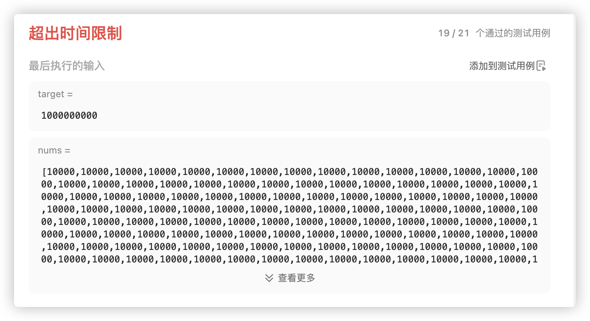
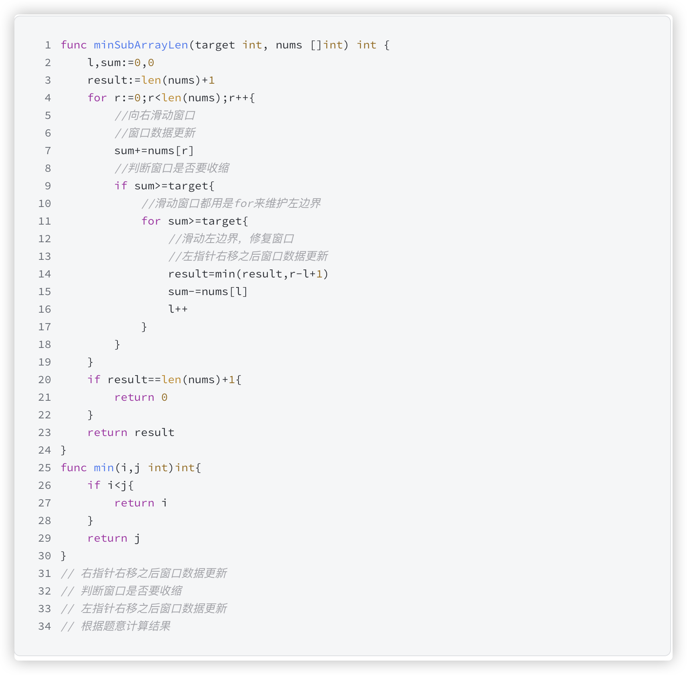

# 官方链接

https://leetcode.cn/problems/minimum-size-subarray-sum/description/


## 题解

https://leetcode.cn/problems/minimum-size-subarray-sum/solutions/3063461/goyu-yan-hua-dong-chuang-kou-miao-dong-b-a0fv/

题目：给你一个数组和target，求出一个连续子数组，并且这个子数组相加要大于等于target，返回子数组最短的长度

思路：滑动窗口，sum大于target的时候就可以收缩左边界，并统计答案。

*   右指针右移之后窗口数据更新
*   判断窗口是否需要收缩
*   左指针右移之后窗口数据更新
*   根据题意计算结果

## Code

### 方法一：暴力解法

```go
func minSubArrayLen(target int, nums []int) int {
    // 获取输入数组的长度
    n := len(nums)

    // 如果数组为空，直接返回 0
    if n == 0 {
        return 0
    }

    // 初始化 ans 为一个很大的数，表示最短子数组的长度
    ans := math.MaxInt32

    // 外层循环，遍历数组每个可能的子数组起始位置
    for i := 0; i < n; i++ {
        sum := 0  // 初始化子数组和为 0
        
        // 内层循环，遍历子数组的结束位置
        for j := i; j < n; j++ {
            sum += nums[j]  // 累加当前元素
            
            // 一旦找到一个和大于或等于 target 的子数组，更新最短子数组长度
            if sum >= target {
                ans = min(ans, j - i + 1)  // 计算当前子数组长度并更新 ans
                break  // 找到满足条件的子数组后，跳出内层循环
            }
        }
    }

    // 如果 ans 没有被更新过，说明没有找到符合条件的子数组
    if ans == math.MaxInt32 {
        return 0
    }

    // 返回最短子数组的长度
    return ans
}

```




很显然，作为一道mid难度的题目，这么去进行解答，是很难AC的


### 方法二：滑动窗口



```go
func minSubArrayLen(target int, nums []int) int {
    // 初始化左指针 l，右指针 r，以及当前窗口的和 sum
    l, sum := 0, 0

    // result 初始化为比 nums 长度更大的值，表示未找到满足条件的子数组
    result := len(nums) + 1

    // r 是右指针，用来遍历 nums 数组
    for r := 0; r < len(nums); r++ {
        sum += nums[r]  // 将当前右指针指向的元素加到 sum 中

        // 如果当前窗口的和大于或等于 target，则尝试缩小窗口
        if sum >= target {
            // 内部循环：当窗口和大于等于 target 时，缩小窗口，尝试找到最小的窗口
            for sum >= target {
                result = min(result, r - l + 1)  // 更新最小子数组长度
                sum -= nums[l]  // 减去左指针指向的元素，缩小窗口
                l++  // 左指针右移，缩小窗口
            }
        }
    }

    // 如果 result 没有更新，说明没有找到符合条件的子数组，返回 0
    if result == len(nums) + 1 {
        return 0
    }

    // 返回找到的最小子数组的长度
    return result
}
```


*   右指针右移之后窗口数据更新
*   判断窗口是否需要收缩
*   左指针右移之后窗口数据更新
*   根据题意计算结果


### 方法三：在 while 循环结束后更新答案

```go
func minSubArrayLen(target int, nums []int) int {
    n := len(nums)
    ans, sum, left := n+1, 0, 0  // 初始化最短子数组长度为 n+1，sum 为 0，左指针为 0
    
    // 遍历数组的右指针
    for right, x := range nums {
        sum += x  // 将右指针位置的值加到 sum
        
        // 内层循环：当窗口和大于等于 target 时，尝试收缩窗口
        for sum >= target {
            ans = min(ans, right-left+1)  // 更新最短子数组长度
            sum -= nums[left]  // 从窗口和中减去左指针位置的元素
            left++  // 移动左指针，缩小窗口
        }
    }
    
    // 如果找到了满足条件的子数组，返回最小长度；否则返回 0
    if ans <= n {
        return ans
    }
    return 0
}

// 辅助函数，返回两个整数中的较小值
func min(i, j int) int {
    if i < j {
        return i
    }
    return j
}

```


### 方法四：在 while 循环内更新答案

```go
func minSubArrayLen(target int, nums []int) int {
    n := len(nums)
    ans, sum, left := n+1, 0, 0
    for right, x := range nums {
        sum += x
        for sum >= target {
            ans = min(ans, right - left + 1)
            sum -= nums[left]
            left++
        }
    }
    if ans <= n {
        return ans
    }
    return 0
}
```


1.  有些是在内部循环外面最后更新最优解(第一种解法)
2.  有些窗口是在内部循环里更新最优解(第2种解法),

1.  前者是内部循环一直不满足条件(本题就是发现减掉left还是比sum大说明现在不是最优解), 该解法在循环外更新最优解, 这个的前提条件是,窗口仅一个元素的时候一定是一个解(不一定最优)
2.  后者是循环内部都满足条件,不断缩小窗口得到最优解, ,缩小窗口直到满足退出循环


*   对于滑动窗口的理解，还是需要理解滑动的过程
*   在思维中存在一个动态的图像，一步步向下进行