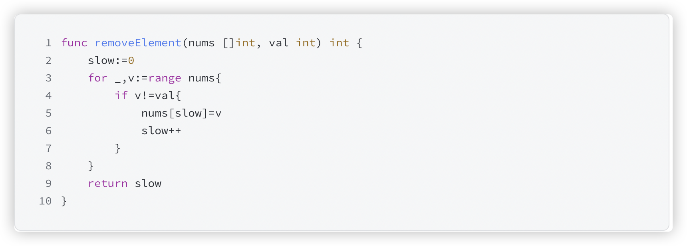

# 官网链接

https://leetcode.cn/problems/remove-element/description/

## 题解

题目：给你一个数组nums和一个值val，要求你把数组中值为val的元素全部删掉，而且不允许你使用额外的数组来辅助解决这题，返回移除val后数组的长度

*   这个地方其实我们可以去总结出来一个规律，当我们看到题目中出现了这样的要求"不允许你使用额外的数组来辅助解决这题"，这个时候我们最好的办法就是去优先考虑双指针的问题
*   这个删除数组中的相关的数值，更重要的不是说直接都删掉，主要去考虑一个遍历的思想
*   由于题目要求删除数组中等于 *val* 的元素，因此输出数组的长度一定小于等于输入数组的长度，我们可以把输出的数组直接写在输入数组上
*   双指针：右指针 *right* 指向当前将要处理的元素，左指针 *left* 指向下一个将要赋值的位置
*   如果右指针指向的元素不等于 val，它一定是输出数组的一个元素，我们就将右指针指向的元素复制到左指针位置，然后将左右指针同时右移；
*   如果右指针指向的元素等于 val，它不能在输出数组里，此时左指针不动，右指针右移一位

## Code

### 双指针

```go
func removeElement(nums []int, val int) int {
    // 使得左边的元素设置为 0
    left := 0
    // 循环遍历数组的 value
    for _, v := range nums {
        // 不是我们要的 value
        if v != val {
            // 放到我们移除 value 的数组里面
            nums[left] = v
            // 位置移到下一位
            left++
        }
    }
    return left
}
```


### 双指针优化

```go
func removeElement(nums []int, val int) int {
    left, right := 0, len(nums)
    for left < right {
        if nums[left] == val {
        //将 right-1 位置的元素移动到 left 位置，实际上就是将最后一个元素移动到当前 left 指向的位置，
        // 这样可以覆盖掉要移除的元素。
            nums[left] = nums[right-1]
            // 然后 right--，缩小右指针，表示已处理的最后一个元素不再参与下一次判断
            right--
        }else {
            left++
        }
    }
    return left
}
```


*   这个地方相比较于第一个方法有所不同的就是
*   在第一个方法中一直在循环遍历到了最结尾的地方，因为我们也不知道最后的一个元素是否是我们想要去删除的，所以我们必须要去进行判断
*   所以第一个中方式是十分浪费时间的
*   在第二种方式中我们在数组的首尾都加上了指针，最巧妙的地方是在我们判断不在是谁不是 value 我们才把它放在数组里面了
*   我们判断的是当数组中的那个值是value的时候，也就是我们需要删除的值的时候
*   我们才会去把那个值不是直接的删除掉，而是我们使用数组最后面的值进行一次替换掉，即是这个最后的值也是我们想要去删除的值，但是这个值我们在下一次循环中也是可以去判断出来的，这样的话数组就会变得越来越小，直到最后返回


思路：题目说不能用额外数组来解决，那就只能原地修改数组了。怎么修改呢，遍历数组，如果该元素不等于val，说明可以存在，那么把该元素存入数组，存入指针递增。如果该元素等于val，说明不可以存在，那么什么都不做，


