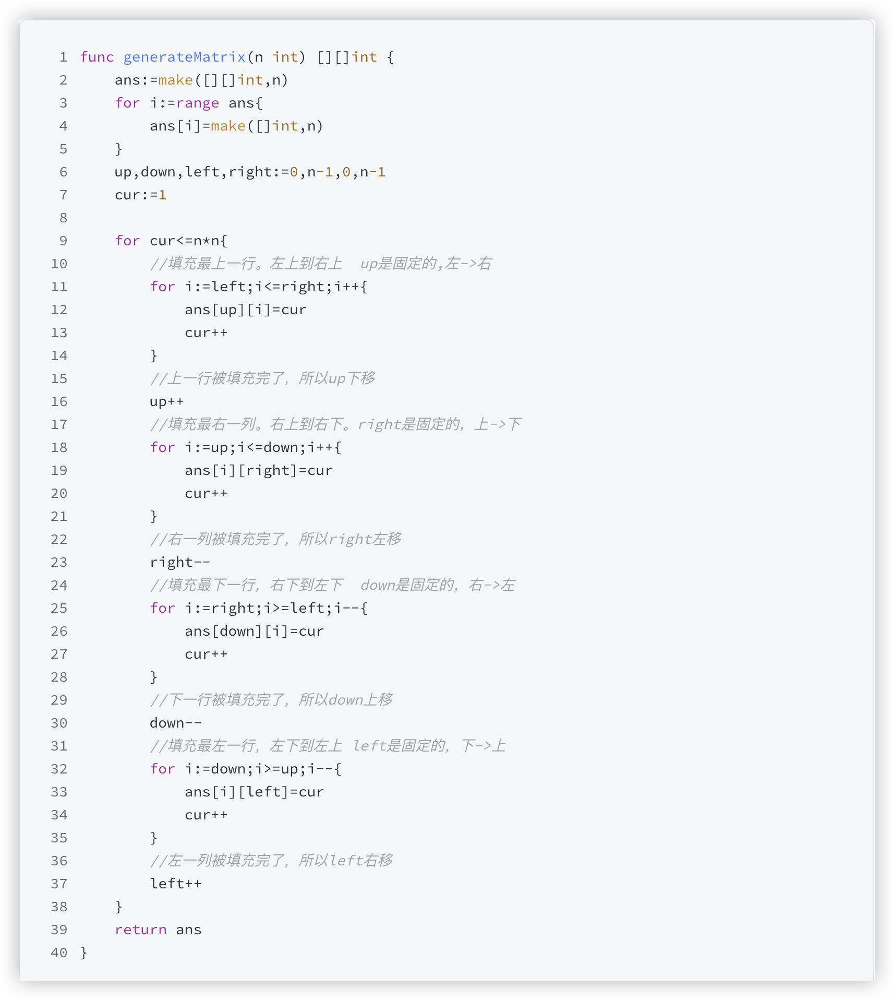
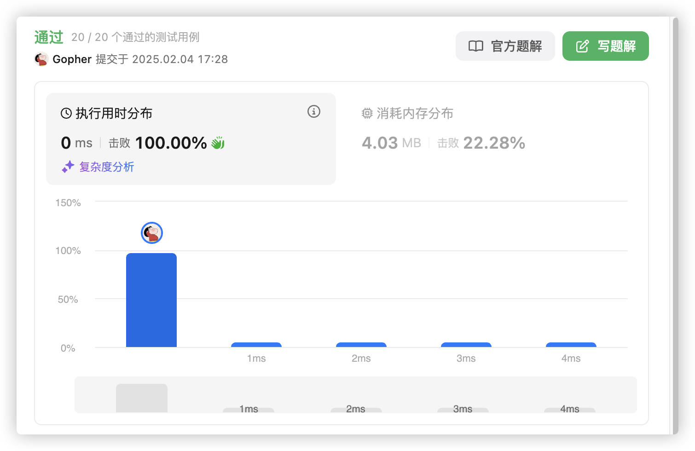
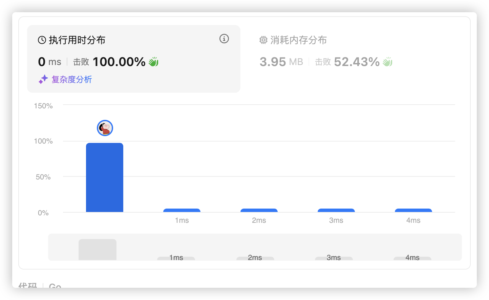

# 官方链接

https://leetcode.cn/problems/spiral-matrix-ii/description/

## 题解

https://leetcode.cn/problems/spiral-matrix-ii/solutions/3063566/goyu-yan-she-zhi-bian-jie-zhuan-qi-lai-b-7sfx/


给你一个正整数 `n` ，生成一个包含 `1` 到 `n2` 所有元素，且元素按顺时针顺序螺旋排列的 `n x n` 正方形矩阵 `matrix` 。

## Code

### 方法一



```go
func generateMatrix(n int) [][]int {
    // 创建一个大小为 n 的二维切片 ans，初始化它的每一行为空的切片
    ans := make([][]int, n)
    
    // 对二维切片的每一行进行初始化，确保每一行是长度为 n 的切片
    for i := range ans {
        ans[i] = make([]int, n)
    }

    // 初始化四个边界，分别是上（up）、下（down）、左（left）、右（right）
    up, down, left, right := 0, n-1, 0, n-1
    cur := 1  // 当前填充的数字，从 1 开始

    // 继续填充，直到填充完成（cur 超过 n*n）
    for cur <= n*n {
        // 从左到右填充上边界
        for i := left; i <= right; i++ {
            ans[up][i] = cur
            cur++
        }
        up++  // 上边界已填充，移动上边界
        
        // 从上到下填充右边界
        for i := up; i <= down; i++ {
            ans[i][right] = cur
            cur++
        }
        right--  // 右边界已填充，移动右边界
        
        // 从右到左填充下边界
        for i := right; i >= left; i-- {
            ans[down][i] = cur
            cur++
        }
        down--  // 下边界已填充，移动下边界
        
        // 从下到上填充左边界
        for i := down; i >= up; i-- {
            ans[i][left] = cur
            cur++
        }
        left++  // 左边界已填充，移动左边界
    }

    // 返回生成的矩阵
    return ans
}
```




### 方法二

```go
var dirs = [4][2]int{{0, 1}, {1, 0}, {0, -1}, {-1, 0}} // 右下左上

func generateMatrix(n int) [][]int {
    ans := make([][]int, n)
    for i := range ans {
        ans[i] = make([]int, n)
    }
    i, j, di := 0, 0, 0
    for val := 1; val <= n*n; val++ {
        ans[i][j] = val
        x, y := i+dirs[di][0], j+dirs[di][1] // 下一步的位置
        // 如果 (x, y) 出界或者已经填入数字
        if x < 0 || x >= n || y < 0 || y >= n || ans[x][y] != 0 {
            di = (di + 1) % 4 // 右转 90°
        }
        i += dirs[di][0]
        j += dirs[di][1] // 走一步
    }
    return ans
}
```



*   第一种方式是上下左右分别去扫描
*   第二种方式判断到出界就去反转
