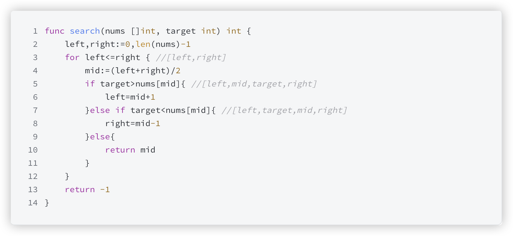

# 官网链接

https://leetcode.cn/problems/binary-search/submissions/596628292/

## 题解

https://leetcode.cn/problems/binary-search/solutions/3063238/er-fen-cha-zhao-bu-hui-man-man-lai-jiu-z-164t/

给定一个 `n` 个元素有序的（升序）整型数组 `nums` 和一个目标值 `target` ，写一个函数搜索 `nums` 中的 `target`，如果目标值存在返回下标，否则返回 `-1`

当我们看到根据数组和目标值去返回下标的时候，这个时候我们就可以去思考是否需要去使用二分查找的方式去解题

```go
func search(nums []int, target int) int {
	// 先对边界进行初始化
	left, right := 0, len(nums)-1
	// check 查找范围
	for left <= right {
		// 确定中值
		mid := (left + right) / 2
		// 目标值大于中值
		if target > nums[mid] {
			// 那么就让中值的位置往左靠一下呗
			left = mid + 1
			// 目标值小于中值
		} else if target < nums[mid] {
			// 那么就让中值的位置往右靠一下呗
			right = mid - 1
            // 慢慢来就找到了
		} else {
			return mid
		}
	}
	return -1
}
```


### Think

*   题目中说这是一个升序数组，所以可以去进行二分查找，二分查找的时间复杂度是O(logN), 如果使用暴力的做法的话那就是O(N)
*   但是在处理二分查找的时候最重要的就是边界值的判定了



*   首先在 for 循环的过程中，是要去划定这个原本的边界不要去跨越，保证不能越界
*   在找出数组中的中值元素
*   接下来就可以使用目标值进行判断了，注意这里的判断也是放在数组中去进行值的比较啊！！！因为我们本来不就是求的是数组的下表嘛
*   左右横移，慢慢来就找到我们想要的东西了
