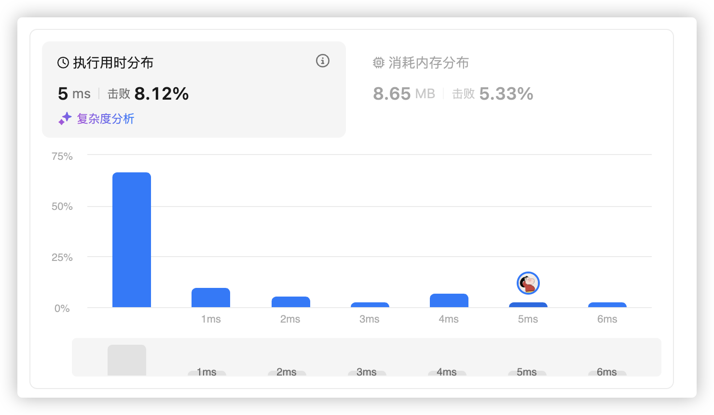
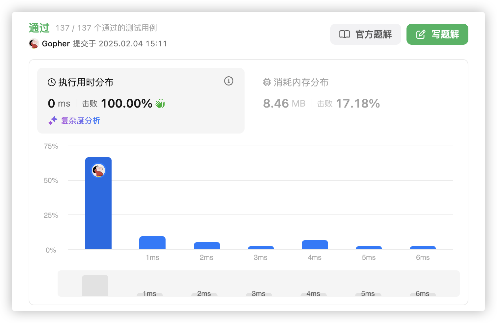
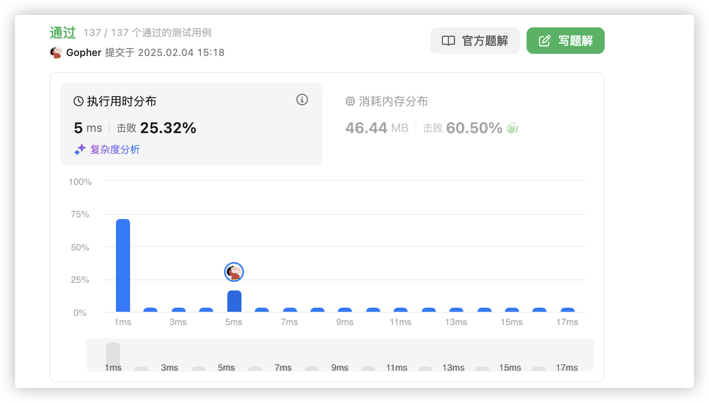
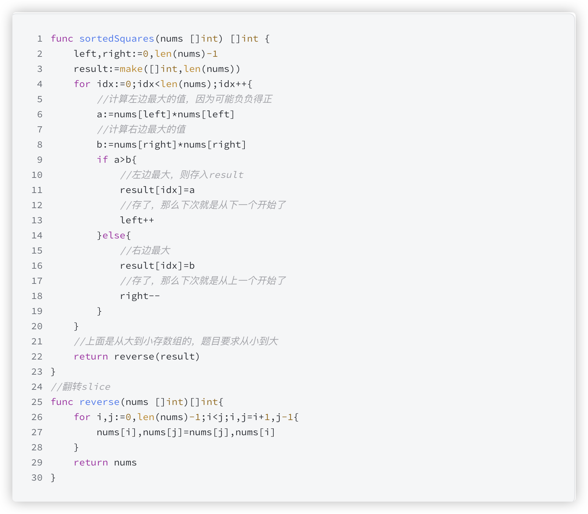

# 官网链接

https://leetcode.cn/problems/squares-of-a-sorted-array/description/

## 题解

https://leetcode.cn/problems/squares-of-a-sorted-array/solutions/3063435/goyu-yan-fu-zhi-fang-shi-qiao-miao-pai-x-yx0h/

## Code

### 方法一 ：双向指针从大到小合并

```go
func sortedSquares(nums []int) []int {
    n := len(nums)
    // 初始化一个长为 n 的空数组 ans
    ans := make([]int, n)
    // 初始化左指针 i=0，右指针 j=n−1
    i, j := 0, n-1
    // 初始化下标 p=n−1，表示要往 ans[p] 填入数据
    for p := n - 1; p >= 0; p-- {
        x := nums[i] * nums[i]
        y := nums[j] * nums[j]
        // 如果 x>y，将 x 填入 ans[p]，把 i 加一，p 减一
        if x > y {
            ans[p] = x
            i++
        // 如果 x≤y，将 y 填入 ans[p]，把 j 减一，p 减一
        }else {
            ans[p] = y
            j--
        }
    }
    return ans
}
```


### 方法二

```go
func sortedSquares(nums []int) (ans[]int) {
    l, r := 0, len(nums)-1
    for l <= r {
        if -nums[l] > nums[r] {
            ans = append(ans, nums[l]*nums[l])
            l++
        }else {
            ans = append(ans, nums[r]*nums[r])
            r--
        }
    }
    slices.Reverse(ans)
    return ans
}
```



*   虽然笔者认为这样的写法真的是比较的聪明，但是这个时间复杂度并不理想


### 方法三

```go
func sortedSquares(nums []int) []int {
    // 获取输入数组的长度
    n := len(nums)

    // 创建一个与输入数组长度相同的切片 ans，用于存储平方后的结果
    ans := make([]int, n)

    // 初始化两个指针，i 指向数组的起始位置，j 指向数组的末尾
    i, j := 0, n-1

    // 从数组的最后一个位置 p 开始填充 ans 数组，逐步向前
    for p := n - 1; p >= 0; p-- {
        // 将当前 i 和 j 指向的元素赋值给 x 和 y
        x, y := nums[i], nums[j]

        // 判断 x 和 y 的绝对值，选择绝对值较大的元素平方放入 ans[p] 中
        if -x > y {
            // 如果 x 的绝对值大于 y，则将 x 的平方放入 ans[p]，然后将 i 向右移动
            ans[p] = x * x
            i++  // i 向右移动，准备处理下一个元素
        } else {
            // 如果 y 的绝对值大于等于 x，则将 y 的平方放入 ans[p]，然后将 j 向左移动
            ans[p] = y * y
            j--  // j 向左移动，准备处理下一个元素
        }
    }

    // 返回排序后的平方结果数组
    return ans
}

```



*   这种方法是十分的巧妙的
*   在最后的位置进行了数组的填充，逐步向前
*   使用符号的方式巧妙的判断绝对值，将小的值放在前面


### 方法四

```java
class Solution {
    public int[] sortedSquares(int[] nums) {
        for (int i = 0; i < nums.length; i++) {
            nums[i] = nums[i] * nums[i];
        }
        Arrays.sort(nums);
        return nums;
    }
}
```

*   当然也可以去使用这样的先平方后排序的方式
*   正常人应该都很好想到，但是在本质上这种方法不是所推崇的
*   在时间和空间上都是一言难尽的


思路：这里的难点是，负数的平方可能比正数的平方大。所以我们可以每次对比左右两边的平方数，在理想情况下，肯定是最右边的平方最大，但是因为有可能存在负数，所以要对比。每次对比出一个最大数之后，就存入新的数组即可



```go
func sortedSquares(nums []int) []int {
    left, right := 0, len(nums)-1
    result := make([]int,len(nums))
    for idx := 0; idx < len(nums); idx++ {
        a := nums[left] * nums[left]
        b := nums[right] * nums[right]

        if a > b {
            result[idx] = a
            left++
        }else {
            result[idx]=b
            right--
        }
    }
    return reverse(result)
}

func reverse(nums []int)[]int {
    for i,j:=0,len(nums)-1; i < j; i, j = i+1, j-1 {
        nums[i],nums[j]=nums[j],nums[i]
    }
    return nums
}
```

