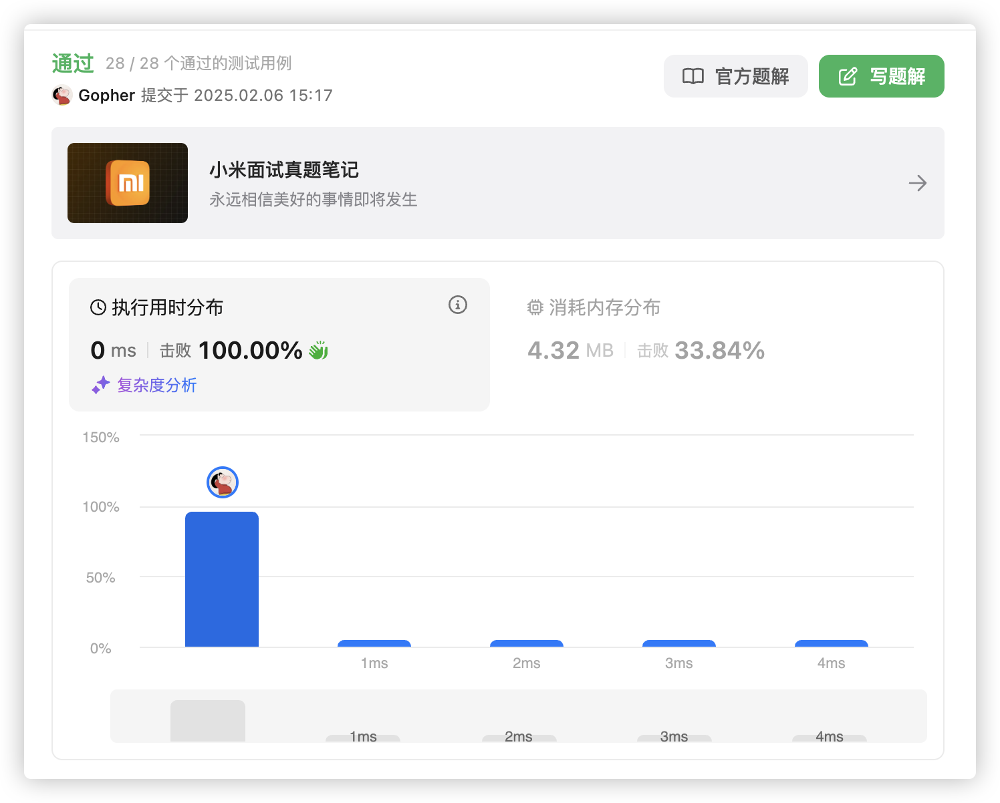

# 官网链接

https://leetcode.cn/problems/reverse-linked-list/

## 题解

https://leetcode.cn/problems/reverse-linked-list/solutions/3065276/goyu-yan-tou-cha-fa-fan-zhuan-lian-biao-qw3a6/

## Code

```go
/**
 * Definition for singly-linked list.
 * type ListNode struct {
 *     Val  int
 *     Next *ListNode
 * }
 */

// reverseList 反转一个单链表，返回反转后的链表头节点
func reverseList(head *ListNode) *ListNode {
    var pre, cur *ListNode = nil, head // pre 为前一个节点，cur 为当前节点
    // 遍历链表，直到 cur 为 nil
    for cur != nil {
        nxt := cur.Next  // 保存当前节点的下一个节点，防止链表断裂
        cur.Next = pre   // 将当前节点的 Next 指向前一个节点，完成反转
        pre = cur        // 将 pre 移动到当前节点，准备处理下一个节点
        cur = nxt        // 将 cur 移动到下一个节点
    }
    // 最终，pre 指向链表的最后一个节点，它是反转后的链表头
    return pre
}

```


