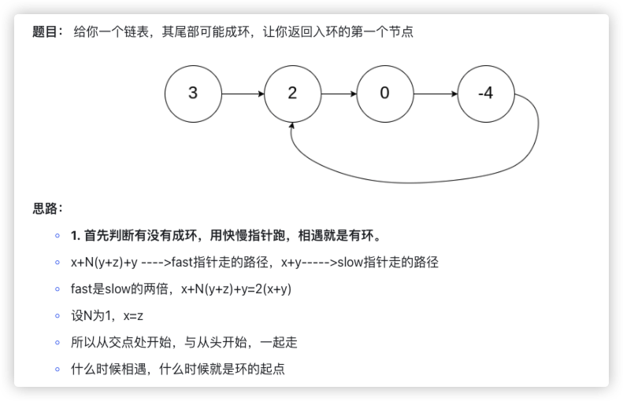
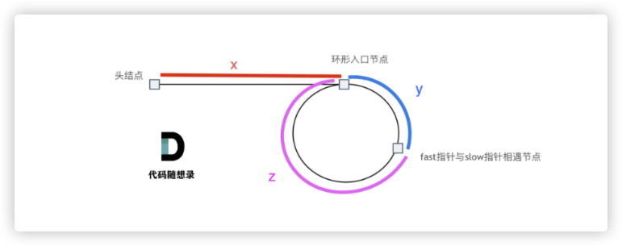
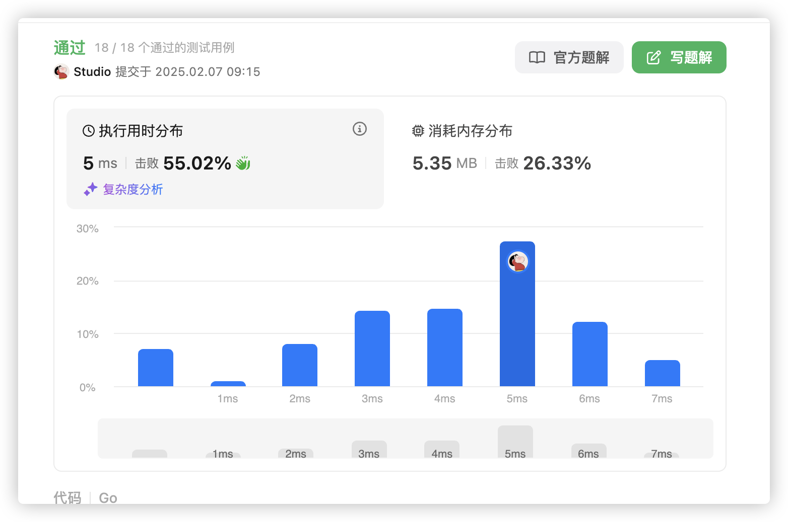

# 官方链接

https://leetcode.cn/problems/linked-list-cycle-ii/description/

## 题解

https://leetcode.cn/problems/linked-list-cycle-ii/solutions/3065975/gohe-shi-xiang-yu-by-jolly-6ermaindir-ouxs/

## Code





```go
/**
 * Definition for singly-linked list.
 * type ListNode struct {
 *     Val int
 *     Next *ListNode
 * }
 */
func detectCycle(head *ListNode) *ListNode {
    slow, fast := head, head
    for fast != nil && fast.Next != nil {
        slow=slow.Next
        fast=fast.Next.Next
        // 相遇有环
        if slow == fast {
            // 从这里开始，与起点一起走，直到相遇
            for head!=slow {
                head=head.Next
                slow=slow.Next
            }
            return slow
        }
    }
    return nil
}
```


