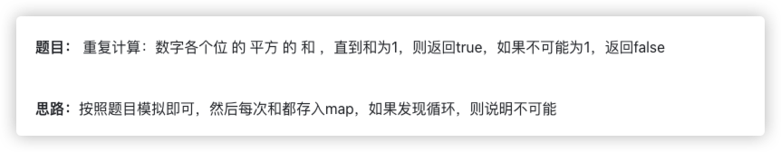

# 官方链接

https://leetcode.cn/problems/happy-number/description/

## 题解

https://leetcode.cn/problems/happy-number/solutions/3065990/goxie-ti-kuai-le-ma-by-jolly-6ermaindir-7px6/

## Code



```go
// isHappy 判断一个数字是否为快乐数
func isHappy(n int) bool {
    // 创建一个 map 来记录已经出现过的数字，避免进入循环
    mp1 := map[int]bool{}
    
    // 不断计算 n 的“数字平方和”，直到 n 为 1 或进入循环
    for {
        // 计算当前数字的数字平方和
        cnt := cal(n)
        n = cnt // 更新 n 为新的数字平方和
        
        // 如果数字平方和为 1，表示 n 是快乐数
        if cnt == 1{
            break
        }

        // 如果当前数字已经出现过，说明进入了循环，不是快乐数
        _, ok := mp1[cnt]
        if ok {
            return false
        }

        // 将当前数字平方和加入 map，记录已出现的数字
        mp1[cnt] = true
    }

    // 如果最后 n 为 1，则说明是快乐数
    return true
}

// cal 计算一个数字的数字平方和
func cal(n int) int {
    sum := 0
    // 对 n 的每一位数字进行平方并累加
    for n > 0 {
        sum += (n % 10) * (n % 10) // 获取最后一位数字，计算其平方并加到 sum
        n /= 10 // 去掉最后一位数字
    }
    return sum // 返回平方和
}

```


