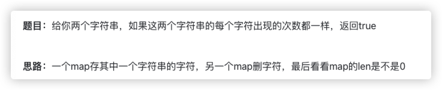

# 官方链接

https://leetcode.cn/problems/valid-anagram/description/

## 题解

https://leetcode.cn/problems/valid-anagram/solutions/3065979/gobian-zeng-bian-shan-by-jolly-6ermaindi-xedn/

## Code



```go
func isAnagram(s string, t string) bool {
    bytesMap := make(map[byte]int)
    for i:=range s {
        ch := s[i]
        bytesMap[ch]++
    }
    for i:=range t {
        ch:=t[i]
        bytesMap[ch]--
        if bytesMap[ch]==0 {
            delete(bytesMap, ch)
        }
    }
    return len(bytesMap)==0
}
```

