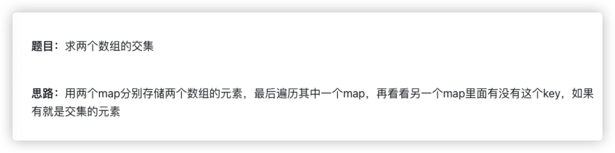
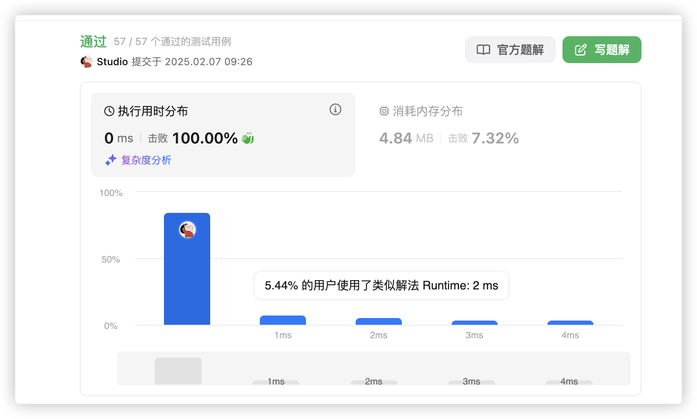

# 官方链接

https://leetcode.cn/problems/intersection-of-two-arrays/description/

## 题解

https://leetcode.cn/problems/intersection-of-two-arrays/solutions/3065986/goliang-ge-map-by-jolly-6ermaindir-s4wy/

## Code



```go
func intersection(nums1 []int, nums2 []int) []int {
    // 创建两个map
    mp1, mp2 := map[int]struct{}{},map[int]struct{}{}
    // 存储数据元素
    for _, v := range nums1 {
        mp1[v]=struct{}{}
    }
    for _, v := range nums2 {
        mp2[v]=struct{}{}
    }
    // 创建一个新的切片
    ans := make([]int,0)
    // 遍历一个
    for k1 := range mp1 {
        // 另一个也有
        _, ok := mp2[k1]
        if ok {
            ans = append(ans, k1)
        }
    }
    // return
    return ans
}
```


