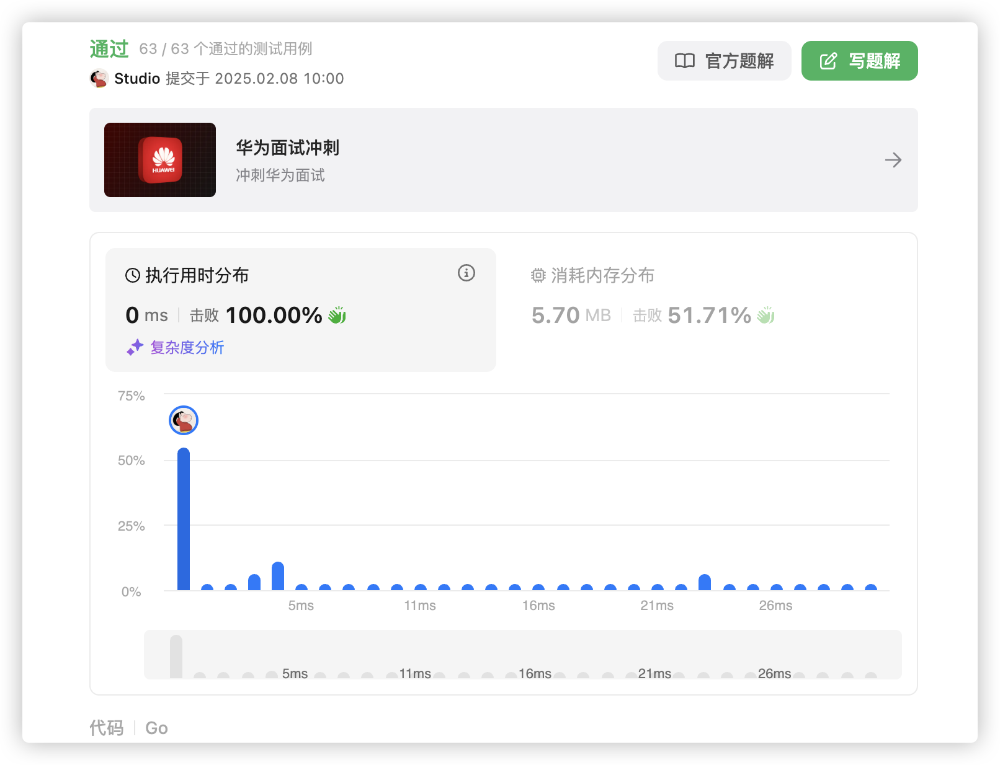
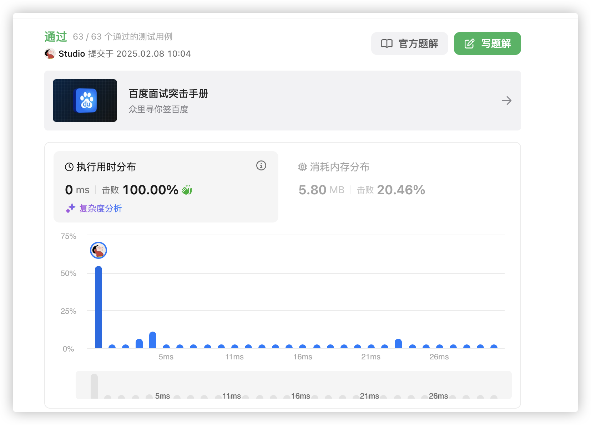
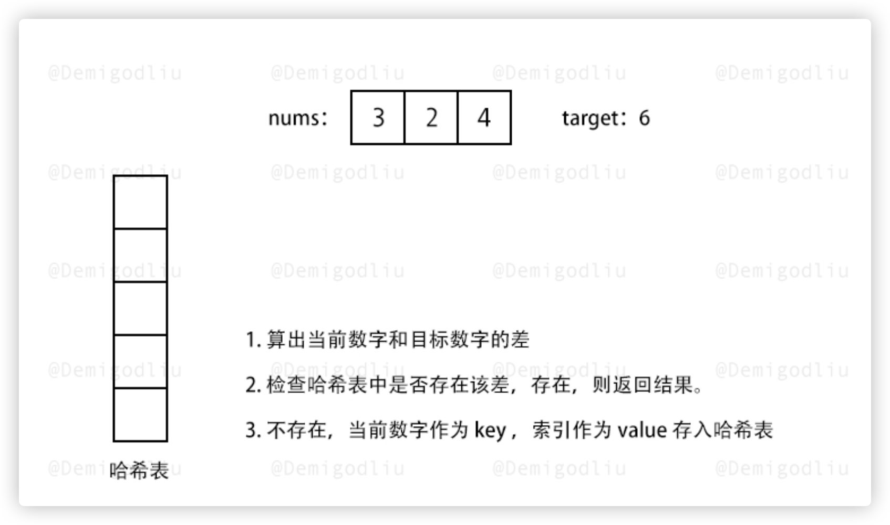
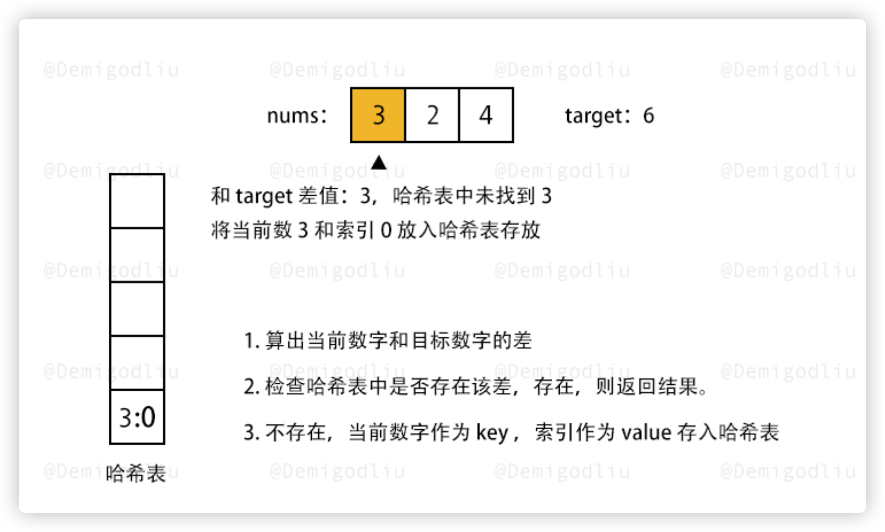
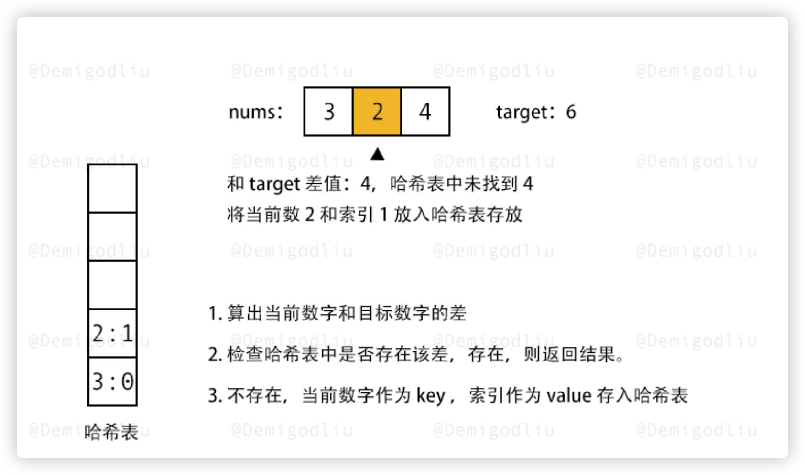
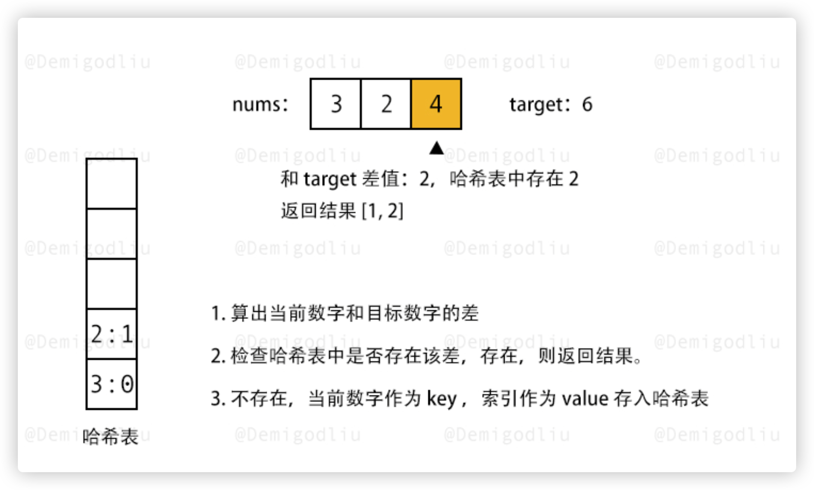

# 官方链接

https://leetcode.cn/problems/two-sum/

## 题解

https://leetcode.cn/problems/two-sum/solutions/3067349/gogogoha-xi-by-jolly-6ermaindir-m7x2/

## Code

题目：给你一个数组和target，问数组里面的哪两个元素之和等于target，如果等于则返回下标

思路：遍历数组，把元素存入map，并查找map中是否存在 target-cur的key

```go
func twoSum(nums []int, target int) []int {
    m1 := make(map[int]int)  // 创建一个哈希表，用于存储数值及其索引
    for idx1, v := range nums {
        key := target - v  // 计算当前元素的配对值
        if idx2, ok := m1[key]; ok {  // 如果配对值已经在哈希表中
            return []int{idx1, idx2}  // 返回当前元素和配对值的索引
        } else {
            m1[v] = idx1  // 将当前元素值和索引存入哈希表
        }
    }
    return []int{0, 0}  // 默认返回值（虽然题目假设一定会有解）
}

```



*   这个地方有点不是很清晰，但是这个题目还是要用哈希表做的


#### 自己写一遍清晰了

```go
func twoSum(nums []int, target int) []int {
    hashTable := map[int]int{}
    for i, x := range nums {
        if p, ok := hashTable[target-x]; ok {
            return []int{p, i}
        }
        hashTable[x] = i
    }
    return nil
}
```









