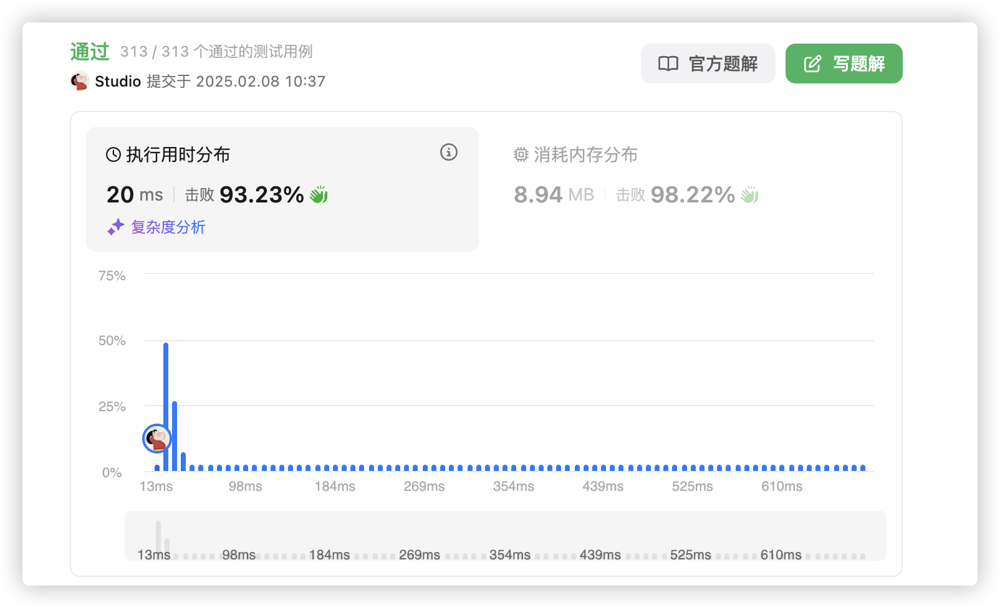

# 官方链接

https://leetcode.cn/problems/3sum/

## 题解

https://leetcode.cn/problems/3sum/solutions/3067397/gomiao-dong-by-jolly-6ermaindir-syy7/

## Code

题目：给你一个数组，求出用3个元素相加等于0的不同三元组

*   两数之合的进阶题目
*   题目说了求不同三元组，所以abc三个数都要去重
*   先排序，固定a，推bc

```go
// 补一个 golang 版本的
func threeSum(nums []int) [][]int {
	// 先从小到大排序
	sort.Ints(nums)
	// 接收结果
	var res [][]int
	// 获取数组长度
	length := len(nums)
	// 边界处理，数字不足三个直接返回空
	if len(nums) < 3 {
		return res
	}
	// 开始循环第一个固定值
	for index, value := range nums {
		// 如果固定位的值已经大于0，因为已经排好序了，后面的两个指针对应的值也肯定大于0，则和不可能为0，所以返回
		if nums[index] > 0 {
			return res
		}
		// 排除值重复的固定位
		if index > 0 && nums[index] == nums[index-1] {
			continue
		}
		// 指针初始位置，固定位右边第一个和数组最后一个
		l := index + 1
		r := length - 1
		// 开始移动两个指针
		for l < r {
			// 判断三个数字之和的三种情况
			sum := value + nums[l] + nums[r]
			switch {
			case sum == 0:
				// 将结果加入二元组
				res = append(res, []int{nums[index], nums[l], nums[r]})
				// 去重，如果l < r且下一个数字一样，则继续挪动
				for l < r && nums[l] == nums[l+1] {
					l += 1
				}
				// 同理
				for l < r && nums[r] == nums[r-1] {
					r -= 1
				}
				l += 1
				r -= 1
			case sum > 0:
				// 如果和大于 0，那就说明 right 的值太大，需要左移
				r -= 1
				// 如果和小于 0，那就说明 left 的值太小，需要右移 
			case sum < 0:
				l += 1
			}
		}
	}
	return res
}
```

