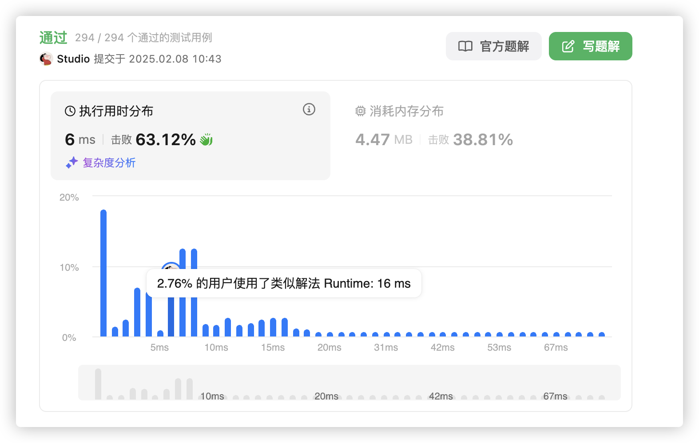

# 官方链接

https://leetcode.cn/problems/4sum/description/

## 题解

https://leetcode.cn/problems/4sum/solutions/3067402/gomiao-dong-by-jolly-6ermaindir-yw4v/

## Code

```go
func fourSum(nums []int, target int) [][]int {
    if len(nums) < 4 {
        return [][]int{}
    }

    sort.Ints(nums)

    var res = make([][]int, 0)
    // O(n^3)
    for i := 0; i < len(nums) - 3; i++ {
        // 忽略后面与前面重复的元素
        if i > 0 && nums[i] == nums[i - 1] {
            continue
        }
        for j := i + 1; j < len(nums) - 2; j++ {
            // 忽略后面与前面重复的元素
            if j > i + 1 && nums[j] == nums[j - 1] {
                continue
            }
            var partSum = nums[i] + nums[j]
            var left, right = j + 1, len(nums) - 1
            for left < right {
                var sum = partSum + nums[left] + nums[right]
                if sum > target {
                    right--
                } else if sum < target {
                    left++
                } else {
                    res = append(res, []int{nums[i], nums[j], nums[left], nums[right]})
                    // 去重
                    for left < right {
                        left++
                        if nums[left - 1] != nums[left] {
                            break
                        }
                    }
                    for left < right {
                        right--
                        if nums[right + 1] != nums[right] {
                            break
                        }
                    }
                }
            }
        }
    }
    return res
}

```

