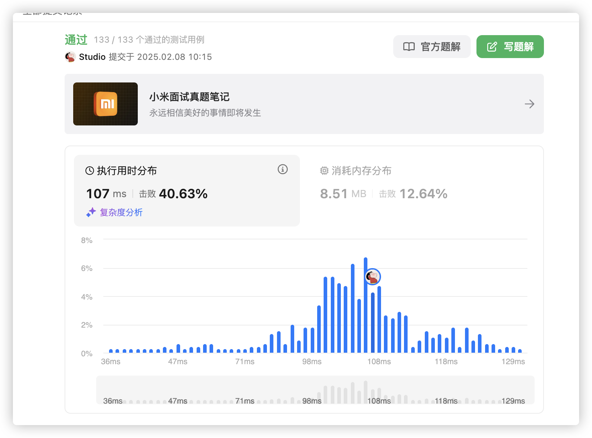
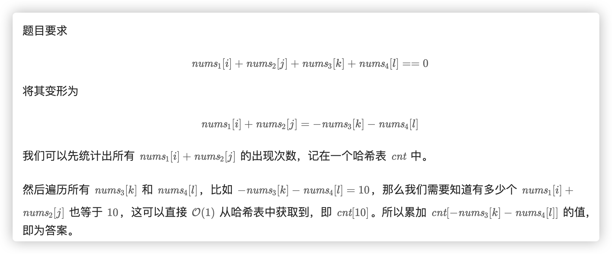

# 官方链接

https://leetcode.cn/problems/4sum-ii/description/

## 题解

https://leetcode.cn/problems/4sum-ii/solutions/3067370/go-map-si-lu-qing-xi-by-jolly-6ermaindir-mxq1/

## Code

题目：给你4个数组，每个数组n个元素，各区每个数组的1个元素，相加等0，一共几种方案

思路：把2个数组元素相加，合并为1个数组，再把另外2个也这样做。现在就是2个数组了，那么问题就退化为两数之和了，两数之和昨天做过。

```go
func fourSumCount(nums1 []int, nums2 []int, nums3 []int, nums4 []int) int {
    m1 := make(map[int]int)
    m2 := make(map[int]int)
    for _,v1 := range nums1 {
        for _, v2 := range nums2 {
            m1[v1+v2]++
        }
    }
    for _,v3 := range nums3 {
        for _, v4 := range nums4 {
            m2[v3+v4]++
        }
    }
    ans := 0
    for k1,v1 := range m1 {
        if _, ok := m2[0-k1]; ok {
            ans += v1 * m2[0-k1]
        }
    }
    return ans
}
```





```go
func fourSumCount(nums1 []int, nums2 []int, nums3 []int, nums4 []int) (ans int) {
    cnt := map[int]int{}
    for _, x := range nums1 {
        for _, y := range nums2 {
            cnt[x+y]++
        }
    }
    for _, x := range nums3 {
        for _, y := range nums4 {
            ans += cnt[-x-y]
        }
    }
    return ans
}
```

