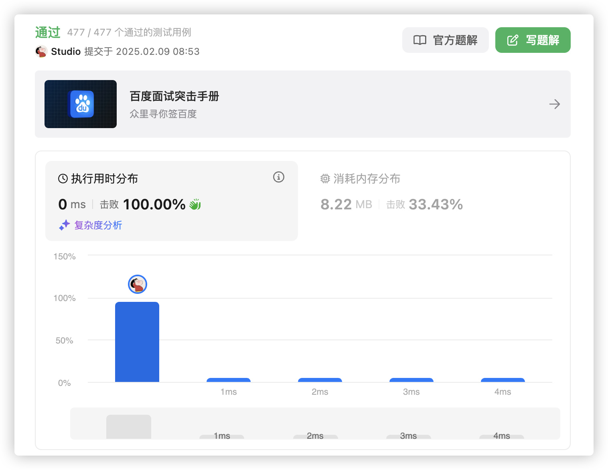

# 官方链接

https://leetcode.cn/problems/reverse-string/description/

## 题解

https://leetcode.cn/problems/reverse-string/solutions/3068440/goyuan-di-jiao-huan-liang-xing-dai-ma-mi-lhxy/

## Code

题目：给你一个字符串，字符串存在数组里面，翻转字符串，不能用额外空间

思路：头尾交换即可

```go
func reverseString(s []byte)  {
    // 初始化左右边界，左往右，右往左
    for i,j:=0, len(s)-1; i<j; i,j=i+1,j-1 {
        // 交换
        s[i], s[j] = s[j], s[i]
    }
    // 返回
    return
}
```

