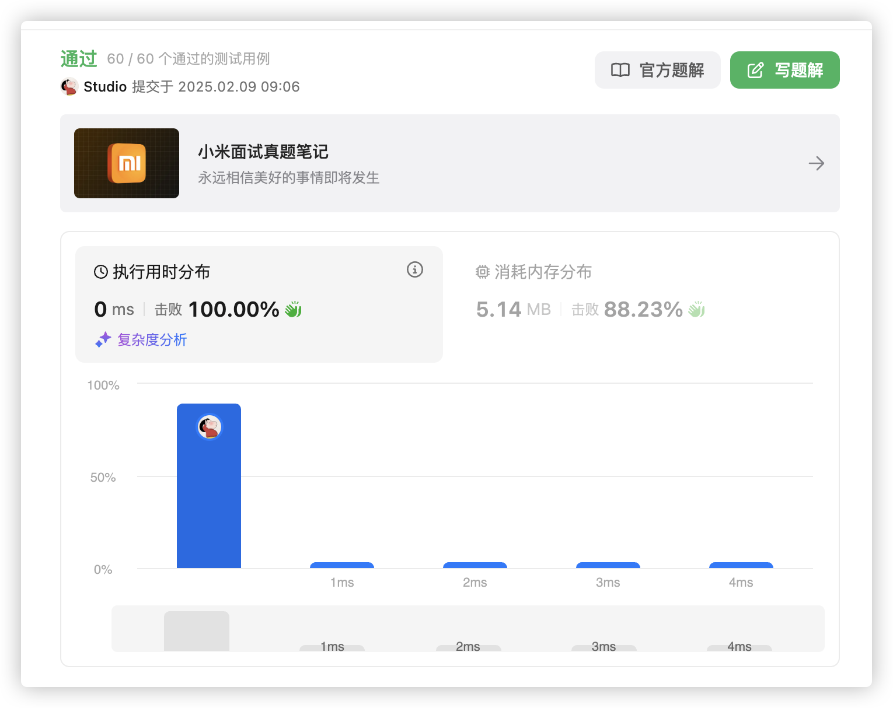

# 官方链接

https://leetcode.cn/problems/reverse-string-ii/description/


## 题解

https://leetcode.cn/problems/reverse-string-ii/solutions/3068445/gomo-ni-100-by-jolly-6ermaindir-v9ph/

## Code

**题目：**给你一个字符串和k，每到2k个字符，就翻转前k个字符。如果剩余字符少于k个则全部翻转，如果小于2k但大于等于k，则翻转前k个

**思路：**模拟题目

```go
func reverseStr(s string, k int) string {
    // define the str
    str := []byte(s)
    // loop in the require
    for i:=0;i<len(str);i=i+2*k{
        if i+k<len(str){
            reverse(str[i:i+k])
        }else{
            reverse(str[i:])
        }
    }
    return string(str)
}

// revserse
func reverse(s []byte) {
    // limit the boundary
    for i,j:=0,len(s)-1;i<j;i,j=i+1,j-1{
        // swap
        s[i],s[j]=s[j],s[i]
    }
}
```

