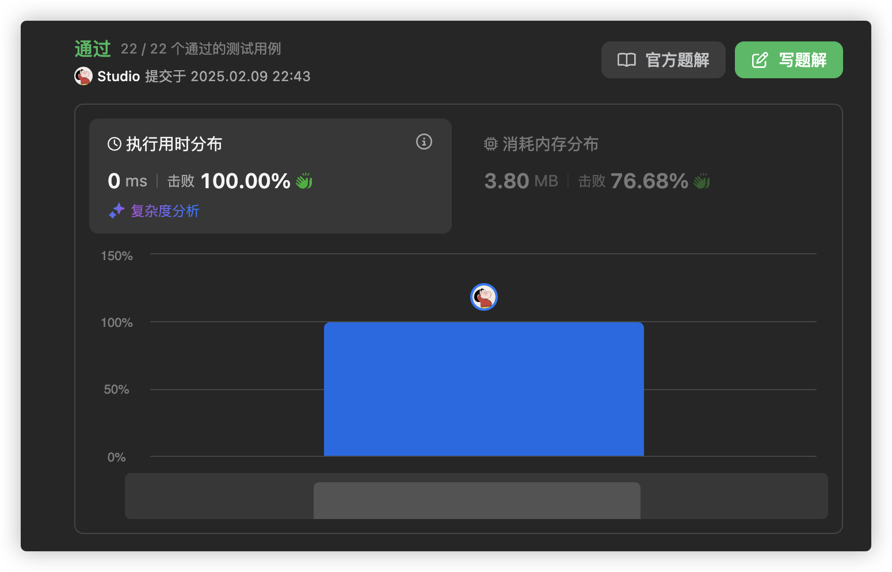

# 官方链接	

https://leetcode.cn/problems/implement-queue-using-stacks/description/

## 题解

https://leetcode.cn/problems/implement-queue-using-stacks/solutions/3069378/go-miao-dong-zhan-shi-xian-dui-lie-by-jo-xtoj/

https://leetcode.cn/problems/implement-queue-using-stacks/solutions/3069389/gozhe-ge-zhu-shi-cheng-du-jiu-hen-qing-x-khuv/

## Code

队列的特性是 FIFO（先入先出），而栈的特性是 FILO（先入后出）。

知道两者特性之后，我们需要用两个栈来模拟队列的特性，一个栈为入队栈，一个栈为出对栈。

当出队栈存在内容时，出队栈的栈顶，即为第一个出队的元素。

若出队栈无元素，我们的需求又是出队的话，我们就需要将入队栈的内容反序导入出队栈，然后弹出栈顶即可。

注意：根据栈的的特性，我们仅能使用 push 和 pop 操作。

```go
// MyQueue 使用两个栈实现的队列结构
// inStack 用于处理入队操作，outStack 用于处理出队和查看队首操作
type MyQueue struct {
    inStack  []int // 入队栈，元素按入队顺序压入
    outStack []int // 出队栈，元素按出队顺序弹出（逆序存储入队元素）
}

// Constructor 初始化一个空队列
func Constructor() MyQueue {
    return MyQueue{
        inStack:  []int{},
        outStack: []int{},
    }
}

// Push 将元素添加到队列的尾部
// 时间复杂度：O(1)
func (q *MyQueue) Push(x int) {
    // 将新元素压入入队栈
    q.inStack = append(q.inStack, x)
}

// in2out 将入队栈中的所有元素转移到出队栈
// 此操作仅在出队栈为空时调用，确保出队顺序正确
// 时间复杂度：O(n)，n 为入队栈的元素数量
func (q *MyQueue) in2out() {
    // 循环将入队栈顶元素弹出，压入出队栈
    for len(q.inStack) > 0 {
        // 获取入队栈顶元素
        top := q.inStack[len(q.inStack)-1]
        // 弹出栈顶元素
        q.inStack = q.inStack[:len(q.inStack)-1]
        // 压入出队栈
        q.outStack = append(q.outStack, top)
    }
}

// Pop 移除并返回队列的头部元素
// 摊还时间复杂度：O(1)
func (q *MyQueue) Pop() int {
    // 如果出队栈为空，转移入队栈元素
    if len(q.outStack) == 0 {
        q.in2out()
    }
    // 获取出队栈顶元素（即队列头部元素）
    x := q.outStack[len(q.outStack)-1]
    // 弹出栈顶元素
    q.outStack = q.outStack[:len(q.outStack)-1]
    return x
}

// Peek 返回队列的头部元素但不移除
// 摊还时间复杂度：O(1)
func (q *MyQueue) Peek() int {
    // 如果出队栈为空，转移入队栈元素
    if len(q.outStack) == 0 {
        q.in2out()
    }
    // 返回出队栈顶元素（即队列头部元素）
    return q.outStack[len(q.outStack)-1]
}

// Empty 检查队列是否为空
// 时间复杂度：O(1)
func (q *MyQueue) Empty() bool {
    // 当两个栈均为空时队列为空
    return len(q.inStack) == 0 && len(q.outStack) == 0
}

/**
 * 代码说明：
 * 1. 使用两个栈（inStack 和 outStack）模拟队列，保证队列的 FIFO 特性。
 * 2. Push 操作直接压入 inStack，时间复杂度 O(1)。
 * 3. 当需要 Pop 或 Peek 时，若 outStack 为空，则将 inStack 元素逆序转移至 outStack，
 *    此时 outStack 的栈顶即为队列头部元素。
 * 4. 摊还分析：每个元素最多经历一次 inStack 压入、一次 inStack 弹出、一次 outStack 压入、
 *    一次 outStack 弹出，均摊时间复杂度为 O(1)。
 */
```


思路：记住栈是先进后出的，队列是先出后进的

两个栈就能去实现一个队列

```go
type MyQueue struct {
    st1 []int
    st2 []int
}


func Constructor() MyQueue {
    return MyQueue {
        st1:make([]int,0),
        st2:make([]int,0),
    }
}


func (this *MyQueue) Push(x int)  {
    this.st1=append(this.st1,x)
}


func (this *MyQueue) Pop() int {
    if len(this.st2)!=0{
        x:=this.st2[0]
        this.st2=this.st2[1:]
        return x
    }else{
        this.st2=this.st1
        this.st1=make([]int,0)
        return this.Pop()
    }
}


func (this *MyQueue) Peek() int {
    if len(this.st2)!=0{
        x:=this.st2[0]
        return x
    }else{
        this.st2=this.st1
        this.st1=make([]instantiated,0)
        return this.Peek()
    }
}


func (this *MyQueue) Empty() bool {
    return len(this.st1) == 0 && len(this.st2)==0
}


/**
 * Your MyQueue object will be instantiated and called as such:
 * obj := Constructor();
 * obj.Push(x);
 * param_2 := obj.Pop();
 * param_3 := obj.Peek();
 * param_4 := obj.Empty();
 */
```

