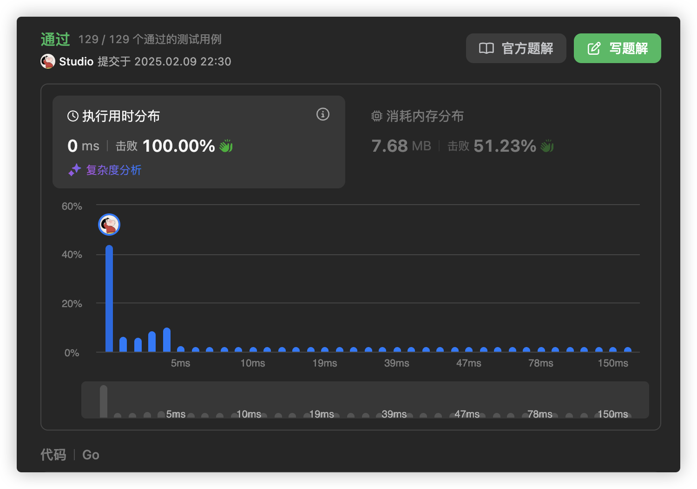

# 官方链接

https://leetcode.cn/problems/repeated-substring-pattern/description/

## 题解

https://leetcode.cn/problems/repeated-substring-pattern/solutions/3069364/goshan-qian-qu-hou-by-jolly-6ermaindir-96np/

## Code

新建一个新字符串str=s+s，把str的首元素和尾元素去掉，剩下的部分如果还含有s，则返回true。

```go
func repeatedSubstringPattern(s string) bool {
    var str1 string = s + s
    var str2 string = str1[1:len(str1)-1]
    if strings.Contains(str2, s) {
        return true
    }else {
        return false
    }
}
```


*   只要两个s拼接在一起，里面还出现一个s的话，就说明是由重复子串组成。
*   在判断s+s拼接的字符串里是否出现一个s的的时候，要刨除s+s的首字符和尾字符，这样避免在s+s中搜索出原来的s
*   我们要搜索的是中间拼接出来的s。

```go
func repeatedSubstringPattern(s string) bool {
    str := []byte(s)
    ss := string(str[1:])+string(str[:len(str)-1])
    return strings.Contains(ss, s)
}
```



