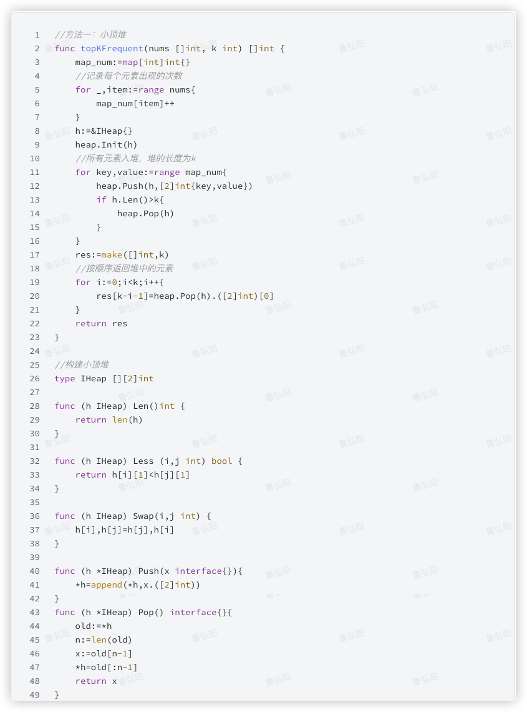

# 官方链接

https://leetcode.cn/problems/top-k-frequent-elements/

## 题解

https://leetcode.cn/problems/top-k-frequent-elements/solutions/3070852/godui-kuai-pai-by-jolly-6ermaindir-j82k/

## Code

```go
 func topKFrequent(nums []int, k int) []int {
    ans := []int{}
    map_num := map[int]int{}
    for _, item := range nums {
        map_num[item]++
    }
    for key, _ := range map_num {
        ans = append(ans, key)
    }
    sort.Slice(ans, func (a,b int)bool{
        return map_num[ans[a]]>map_num[ans[b]]
    })
    return ans[:k]
}
```


