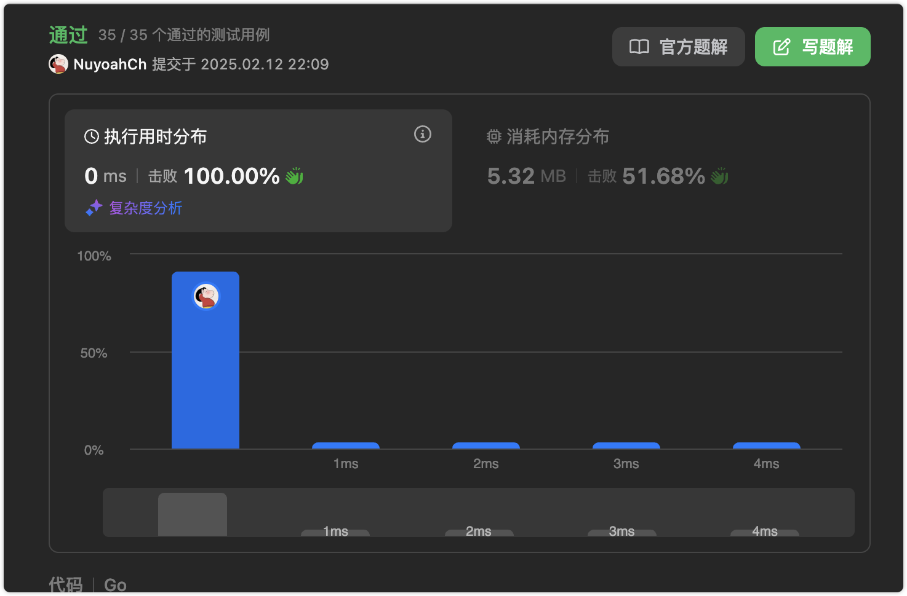

# 官方链接

https://leetcode.cn/problems/binary-tree-level-order-traversal/description/

## 题解

https://leetcode.cn/problems/binary-tree-level-order-traversal/solutions/3072885/go-yong-dui-lie-cun-chu-mei-yi-ceng-de-y-t8yx/

## Code

**题目：给你二叉树的根节点 root ，返回其节点值的 层序遍历 。 （即逐层地，从左到右访问所有节点）。**

```go
/**
 * Definition for a binary tree node.
 * type TreeNode struct {
 *     Val int
 *     Left *TreeNode
 *     Right *TreeNode
 * }
 */
func levelOrder(root *TreeNode) (res [][]int) {
	// check the code
	if root == nil {
		return
	}

	// queue ： 对列, level ： 当前的层数
	queue, level := []*TreeNode{root}, 0
	for len(queue) > 0 {
		// 当前层有多少结点
		length := len(queue)
		res = append(res, []int{})
		// 我们不仅要将当前层的节点加入res结果集，还有把他们的左右子树放进 队列，用于下一层遍历
        for i := 0; i < length; i++ {
            res[level] = append(res[level], queue[i].Val)
            // 左孩子
            if queue[i].Left != nil {
                queue = append(queue, queue[i].Left)
            }
            // 右孩子
            if queue[i].Right != nil {
                queue = append(queue, queue[i].Right)
            }
        }
        // 出队（把已经遍历完的  当前层所有节点删除）
        queue = queue[length:]
        // 来到下一层
        level++
	}
    return 
}
```


