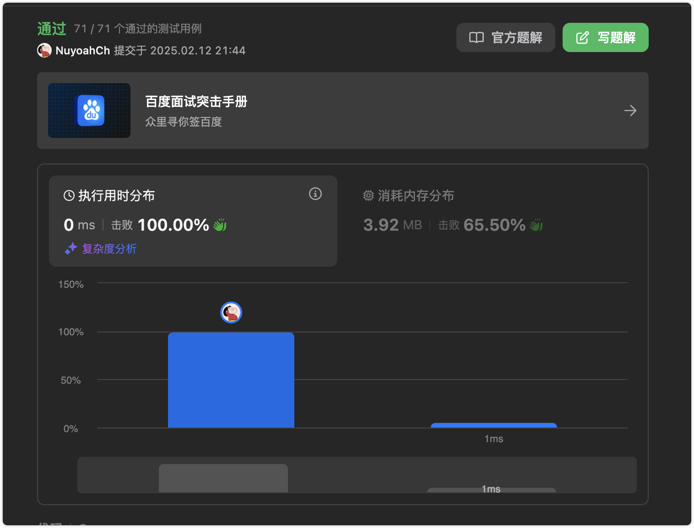

# 官方链接

https://leetcode.cn/problems/binary-tree-preorder-traversal/description/

## 题解

https://leetcode.cn/problems/binary-tree-preorder-traversal/solutions/3072841/go-di-gui-qian-xu-bian-li-by-jolly-6erma-lat3/

## Code

**题目：给你二叉树的根节点** **root** **，返回它节点值的 前序** **遍历。**

### 递归

*   二叉树的前序遍历：按照访问根节点——左子树——右子树的方式遍历这棵树
*   访问左子树或者右子树的时候，我们按照同样的方式遍历，直到遍历完整棵树
*   天然具有递归的性质，我们可以直接用递归函数来模拟这一过程

```go
/**
 * Definition for a binary tree node.
 * type TreeNode struct {
 *     Val int
 *     Left *TreeNode
 *     Right *TreeNode
 * }
 */
func preorderTraversal(root *TreeNode) (vals []int) {
    var preorder func(*TreeNode)
    preorder = func(node *TreeNode) {
        if node == nil {
            return
        }
        vals = append(vals, node.Val)
        preorder(node.Left)
        preorder(node.Right)
    }
    preorder(root)
    return
}
```


### 迭代

```go
type Command struct{
    // 用于标记，我们当前节点是需要遍历(go)，还是要打印(print)​
    s string
    // 封装外层node
    node *TreeNode
}

func preorderTraversal(root *TreeNode)(res []int){
    if root == nil{
        return
    }
    // 构造栈
    stack := make([]Command, 0)
    // 将第一个需要遍历的节点加入栈，s 表示标记为需要遍历(go)
    stack = append(stack, Command{s:"go",node:root})
    
    // 这里知道栈 为空，因为我们每次遍历，都会加入新的节点
    for len(stack) != 0{
        command := stack[len(stack)-1] //取栈顶元素
        stack = stack[:len(stack)-1] //出栈
    
        if command.s == "print" {
            // 这就相当于是打印，其实就是加入结果集
            res = append(res, command.node.Val)
        }else{
            // 右
            if command.node.Right != nil{
                stack = append(stack, Command{s:"go",node:command.node.Right})
            }
            // 左
            if command.node.Left != nil{
                stack = append(stack, Command{s:"go",node:command.node.Left})
            }
            
            // 为什么这个放后面呢：我们前序遍历是：根左右，但是我这里使用的数据结构是栈
            // 所以按照先进后出，进变成了 右左根
            // 根
            stack = append(stack, Command{s:"print",node:command.node})
        }
    }

    return res
}
```


