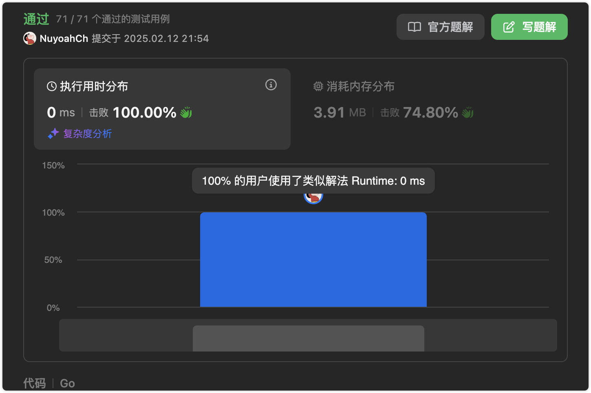

# 官方链接

https://leetcode.cn/problems/binary-tree-postorder-traversal/

## 题解

https://leetcode.cn/problems/binary-tree-postorder-traversal/solutions/3072868/go-di-gui-by-jolly-6ermaindir-s0fm/

## Code

**题目：给你一棵二叉树的根节点** **root** **，返回其节点值的 后序遍历 。**

```go
/**
 * Definition for a binary tree node.
 * type TreeNode struct {
 *     Val int
 *     Left *TreeNode
 *     Right *TreeNode
 * }
 */
func postorderTraversal(root *TreeNode) (res []int) {
    var postorder func(*TreeNode)
    postorder = func(node *TreeNode) {
        if node == nil {
            return
        }
        postorder(node.Left)
        postorder(node.Right)
        res = append(res, node.Val)
    }
    postorder(root)
    return
}
```


