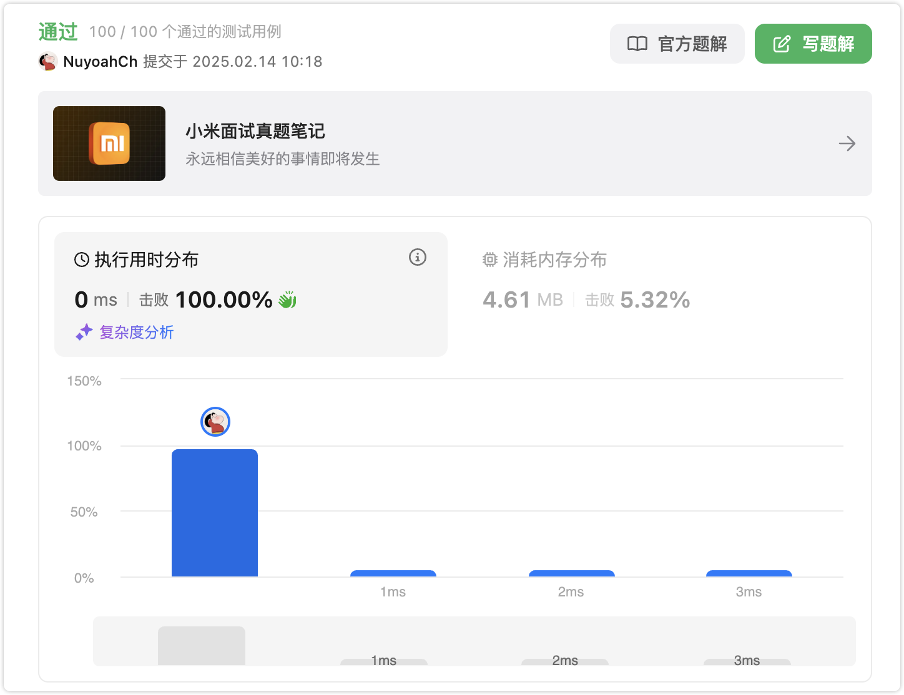

# 官方链接

https://leetcode.cn/problems/sum-of-left-leaves/description/

## 题解

https://leetcode.cn/problems/sum-of-left-leaves/solutions/3074215/gowu-nao-di-gui-jia-ge-flagbiao-ji-yi-xi-gzy6/

## Code

```go
/**
 * Definition for a binary tree node.
 * type TreeNode struct {
 *     Val int
 *     Left *TreeNode
 *     Right *TreeNode
 * }
 */
func sumOfLeftLeaves(root *TreeNode) int {
    var trace func(*TreeNode, bool) int
    trace=func(root *TreeNode, isL bool) int{
        if root == nil {
            return 0
        }
        if root.Left==nil && root.Right==nil &&isL {
            return root.Val
        }
        left := trace(root.Left,true)
        right := trace(root.Right,false)
        return left+right
    }
    return trace(root,false)
}
```


